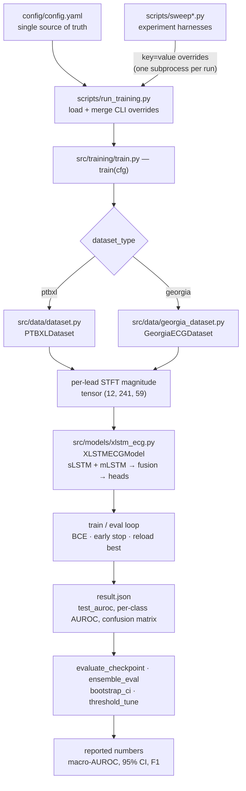

# xLSTM-ECG — Reproduction on PTB-XL and the Georgia 12-Lead ECG Challenge

**Johannes Kepler University Linz** — ML Seminar & Practical Work 2026S \
**Author:** Thomas Tschoellitsch \
**Supervisor:** Dr. Philipp Seidl, MSc

This repository reproduces **xLSTM-ECG** (Kang et al., 2025, [arXiv:2504.16101](https://arxiv.org/abs/2504.16101)) for multi-label ECG classification on **PTB-XL**, and transfers the method to the **Georgia 12-Lead ECG Challenge** (PhysioNet/CinC 2020). The model turns each 12-lead ECG into per-lead spectrograms, processes them with paired sLSTM/mLSTM stacks, and predicts diagnostic classes with one sigmoid head per class.

**What reproduces, and what does not.** The recipe stated in Section 4.3 of the original study reproduces to a macro-AUROC of **0.8861** on PTB-XL — the study's reported **0.9133** lies *outside* our 95 % bootstrap confidence interval. A disclosed corrected recipe (`results_matching`: dropout 0.1, embedding 512, 4 blocks, keeping the study's StepLR) reaches a 10-seed ensemble of **0.9088** (95 % CI [0.8990, 0.9187], which *contains* 0.9133). On Georgia, the same `results_matching` recipe at nb=6 reaches a 10-seed ensemble of **0.9460** (95 % CI [0.9334, 0.9576]), inside an interval that contains all three of the study's Table 7 claims.

## How the code fits together

Every experiment is the **same code run with different configuration values**. One training run reads `config/config.yaml`; the sweep scripts never edit it — they launch `run_training.py` as a subprocess and pass `key=value` overrides that win over the defaults. That single idea explains the whole repository.



### Walkthrough — the pipeline stage by stage

The diagram above, read top to bottom. Each stage maps to one file.

**1. Configuration and entry point — `config/config.yaml`, `scripts/run_training.py`.** `config.yaml` holds every setting (each documented inline); `run_training.py` loads it, merges any `key=value` CLI overrides, resolves the result, and calls `train(cfg)`. It does nothing scientific itself, so an interactive run and an automated sweep run go through identical code, and any experiment is fully described by its config plus overrides.

**2a. PTB-XL data — `src/data/dataset.py`.** The label is decided in `build_label_vector()`: PTB-XL annotations arrive as `{SCP code: confidence 0–100}`, and the default `lik_eq_100` rule keeps only fully-confident codes, turning a cardiologist's hedged read into a 5-class binary vector (NORM/MI/STTC/CD/HYP); a record left with no kept code is dropped. `compute_stft()` builds a per-lead spectrogram (`nperseg=64, noverlap=48, nfft=480` → 241 frequency bins × 59 time frames). `PTBXLDataset` selects the standard folds (train 1–8 / val 9 / test 10), drops one broken record, prints its per-class counts, and caches each `(12,241,59)` spectrogram to disk.

**2b. Georgia data — `src/data/georgia_dataset.py`.** The Georgia-side twin, built to emit the *exact same* `(12,241,59)` shape so one model serves both datasets. `_load_and_preprocess()` is the chain that makes that true: load the 500 Hz WFDB record → resample to 100 Hz → crop/pad to 1000 samples → identical STFT. The label is 7 SNOMED-coded rhythm/conduction classes; the two paper-silent choices live here as config knobs — the group split (`paper_strict`: test g1, train g2–g11, no real validation set) and `drop_no_target_codes` (drop the ~40 % of records carrying none of the 7 target codes).

**3. Model — `src/models/xlstm_ecg.py`.** A learned linear projection maps each per-frame feature vector to the embedding width; two parallel block stacks (one sLSTM, one mLSTM) then process it, combined by `fusion_type` (default `layer`: average the two after every block, feeding the mean back into both). A LayerNorm and mean-pool collapse the 59 frames to one vector, and `num_classes` linear heads with a sigmoid give the per-class probabilities.

**4. Training loop — `src/training/train.py`.** `train(cfg)` builds the dataset for `dataset_type`, reshapes each batch to `(B, 59, 2892)`, normalizes, optionally random-masks (training only), and runs train→eval each epoch under binary cross-entropy, tracking the best validation AUROC with early stopping. After stopping it reloads the best checkpoint, computes the final test metrics, and — if `training.result_file` is set — writes a `result.json` (whose `test_auroc` every sweep reads back).

**5. Evaluation tools — `scripts/`.** `evaluate_checkpoint.py` re-scores a checkpoint with full per-class metrics; `ensemble_eval.py` averages several seeds' sigmoid outputs into one ensemble score; `bootstrap_ci.py` puts a 95 % bootstrap CI on a checkpoint or an ensemble; `threshold_tune.py` calibrates per-class F1 thresholds. Every headline number is an ensemble plus a bootstrap CI from these.

**6. Sweeps and reproduction — `scripts/sweep_*.py`, `reproduce.sh`.** Each sweep is a harness that builds one override dict per run and shells out to `run_training.py`, never editing the config. `sweep_main` is the corrected-label program (baseline, fusion ablation, 10-seed ensemble, Georgia depths); `sweep_mask_ablation`, `sweep_nfft_ablation`, and `sweep_leave_one_out` are the named ablations; `sweep_results_matching_georgia` is the Georgia depth sweep. `reproduce.sh` ties the headline path together (train seeds → ensemble → bootstrap CI).

## Datasets

Both datasets are downloaded separately from PhysioNet and are **not included here**. Follow PhysioNet's terms of use.

- **PTB-XL** v1.0.3 — <https://physionet.org/content/ptb-xl/1.0.3/> (21,837 12-lead records, ~30 GB). We use the 100 Hz signals (`filename_lr`), the standard 10-fold split (train 1–8, val 9, test 10), and the 5 diagnostic superclasses NORM / MI / STTC / CD / HYP.
- **Georgia 12-Lead ECG Challenge** (PhysioNet/CinC 2020) v1.0.2 — <https://physionet.org/content/challenge-2020/1.0.2/> (the `training/georgia` subset), resampled to 100 Hz, with 7 rhythm/conduction classes NSR / AF / IAVB / LBBB / RBBB / SB / STach and the study's group split (test = g1, train = g2–g11).

Download (template, then a concrete example):

```bash
wget -r -N -c -np -nH --cut-dirs=3 -P <root>/ptb-xl-1.0.3 https://physionet.org/files/ptb-xl/1.0.3/
wget -r -N -c -np -nH --cut-dirs=3 -P <root>/georgia-12-lead-ecg-challenge-1.0.2/training/georgia https://physionet.org/files/challenge-2020/1.0.2/training/georgia/

# example
wget -r -N -c -np -nH --cut-dirs=3 -P /data/ptb-xl-1.0.3 https://physionet.org/files/ptb-xl/1.0.3/
```

**Pointing the code at your data: edit one line.** All four data paths derive from a single base, `data.root`, in `config/config.yaml`:

```yaml
data:
  root: /data/nvme1n1                                   # <-- set this to where you downloaded the data
  data_dir: ${data.root}/ptb-xl-1.0.3
  cache_dir: ${data.root}/ptb-xl-stft-cache
  georgia_dir: ${data.root}/georgia-12-lead-ecg-challenge-1.0.2/training/georgia
  georgia_cache_dir: ${data.root}/georgia-stft-cache
```

Change `data.root` (or override any single path on the command line, e.g. `data.data_dir=/elsewhere`).

## Installation

```bash
cd submission
python3.12 -m venv .venv
source .venv/bin/activate
pip install -r requirements.txt          # or requirements-lock.txt for a pinned, bit-reproducible env
python -c "import torch; print(torch.cuda.device_count(), 'GPU(s)')"
pytest                                    # expect "21 passed, 1 skipped" on CPU, "22 passed" with a GPU
```

Tested on Linux (Ubuntu 24.04, kernel 6.17), Python 3.12, PyTorch 2.11.0 + CUDA 13.0. Training needs an NVIDIA GPU (≥ 16 GB) and a system CUDA toolkit (`nvcc`) on `PATH`: the sLSTM kernel is JIT-compiled on first use, and the `+cu130` wheel ships only the runtime. The unit tests run on CPU with no GPU and no data.

## Configuration

`config/config.yaml` is the single source of truth, and **every key is documented inline** in that file. `run_training.py` loads it with [OmegaConf](https://omegaconf.readthedocs.io) and applies any `key=value` overrides (dotlist syntax). The committed defaults reproduce Section 4.3 of the original study plus the `lik_eq_100` PTB-XL label rule. The most important knobs:

| Key | Default | Meaning |
|---|---|---|
| `data.root` | `/data/nvme1n1` | base folder all data paths derive from — usually the only path you set |
| `data.dataset_type` | `ptbxl` | `ptbxl` (5 superclasses) or `georgia` (7 classes) |
| `data.label_aggregation` | `lik_eq_100` | PTB-XL label rule: `lik_gt_0` \| `lik_eq_100` \| `primary_max_lik` |
| `data.georgia_drop_no_target_codes` | `true` | drop Georgia records with no target SNOMED code |
| `data.nfft` | `480` | STFT FFT length → frequency bins F = nfft/2+1 |
| `model.embedding_dim` | `256` | xLSTM block hidden width (results-matching: 512) |
| `model.num_blocks` | `2` | stacked blocks per branch / depth (results-matching: 4) |
| `model.dropout` | `0.5` | dropout (results-matching: 0.1) |
| `model.fusion_type` | `layer` | `layer` \| `sequential` \| `slstm_only` \| `mlstm_only` |
| `model.num_classes` | `5` | 5 for PTB-XL; 7 for Georgia |
| `training.lr_scheduler` | `step` | the study's StepLR (others available) |
| `training.early_stopping_patience` | `5` | epochs w/o val-AUROC gain (use 999 for Georgia paper-strict) |
| `training.num_epochs` | `500` | max epochs (use 20 for Georgia paper-strict) |

## Reproducing the results (in order)

```bash
# 0. install + verify (above), then activate the venv. All commands run from submission/.

# 1. point the code at your data
#    edit config/config.yaml -> data.root   (or pass EXTRA="data.root=/your/path" below)

# 2. (optional) pre-build the PTB-XL STFT cache for a fast first epoch
python scripts/precompute_stft.py --nfft 480 --num_workers 64

# 3. the three headline results  (each: train seeds -> ensemble -> bootstrap CI)
bash scripts/reproduce.sh ptbxl       # PTB-XL results_matching 10-seed ensemble  0.9088  [0.8990, 0.9187]
bash scripts/reproduce.sh combined    # PTB-XL combined-axis 10-seed ensemble 0.9100 [0.9000, 0.9199]
bash scripts/reproduce.sh georgia     # Georgia nb=6 10-seed ensemble         0.9460  [0.9334, 0.9576]

# 4. the ablation tables + baselines (paper-recipe baseline, Tables 2-5, Table 7, corrected-recipe LOO)
bash scripts/reproduce.sh ablations

# ...or the full program (headlines + every ablation) in one go:
bash scripts/reproduce.sh all
```

`reproduce.sh` is portable and resumable (a seed whose `result.json` already exists is skipped). Useful environment knobs: `GPUS=0,1` (round-robin seeds across GPUs), `SEEDS="42"` (single-seed smoke test), `EXTRA="data.root=/my/data"` (point at your data without editing the file — applies to the headline runs).

| Reported result | Command | Output |
|---|---|---|
| PTB-XL headline — results_matching 10-seed ensemble, **0.9088** [0.8990, 0.9187] | `bash scripts/reproduce.sh ptbxl` | `results/repro_ptbxl_results_matching/` |
| PTB-XL combined-axis 10-seed ensemble, **0.9100** [0.9000, 0.9199] | `bash scripts/reproduce.sh combined` | `results/repro_ptbxl_combined/` |
| PTB-XL paper-recipe baseline, **0.8861** (10-seed mean) | `python scripts/sweep_main.py --gpus 0,0,0,1,1,1 --phases C` | `results/sweep_main/C_paper_exact_s*/` |
| Georgia — results_matching depth sweep nb=2/4/6; nb=6 ensemble **0.9460** [0.9334, 0.9576] | `bash scripts/reproduce.sh georgia` | `results/repro_georgia_results_matching/nb{2,4,6}/` |
| Georgia paper-recipe per-depth (Table 7) | `python scripts/sweep_main.py --gpus 0,0,0,1,1,1 --phases D` | `results/sweep_main/D_georgia_paper_nb*/` |
| Fusion ablation (Table 5) | `python scripts/sweep_main.py --gpus 0,0,0,1,1,1 --phases B` | `results/sweep_main/B_table5_*/` |
| N_FFT ablation (Table 2) | `python scripts/sweep_nfft_ablation.py --gpus 0,0,0,1,1,1` | `results/sweep_nfft_ablation/` |
| mask_ratio / mask_prob ablations (Tables 3, 4) | `python scripts/sweep_mask_ablation.py --gpus 0,0,0,1,1,1` | `results/sweep_mask_ablation/` |
| Corrected-recipe leave-one-out ablation | `python scripts/sweep_leave_one_out.py --gpus 1,1,1` | `results/sweep_leave_one_out/` |

The `--gpus` list is a worker list: a GPU id may repeat to oversubscribe it (`0,0,0,1,1,1` = three workers per H100).

## Tests

```bash
pytest          # CPU-only, no data needed (~30 s)
```

The suite pins the contracts the reported numbers depend on: PTB-XL label aggregation, STFT shapes, the Georgia split, and model output (shape / sigmoid range / no NaNs). The single CUDA-kernel test is skipped when no GPU or `ninja` is available.

## Repository layout

```
submission/
├── config/config.yaml          # single source of truth; every key documented inline
├── src/
│   ├── data/dataset.py         # PTB-XL: label aggregation (lik_eq_100), per-lead STFT, (12,241,59) tensors
│   ├── data/georgia_dataset.py # Georgia: 7 SNOMED classes, 500->100 Hz resample, paper-strict group split
│   ├── models/xlstm_ecg.py     # XLSTMECGModel — sLSTM+mLSTM stacks, 2 fusion strategies + 2 module ablations (Table 5)
│   └── training/train.py       # train(cfg): the single training entry point (loop, metrics, result.json)
├── scripts/
│   ├── run_training.py         # CLI for one run (config.yaml + key=value overrides)
│   ├── precompute_stft.py      # optional: pre-build the PTB-XL STFT cache
│   ├── evaluate_checkpoint.py  # re-score a checkpoint (per-class AUROC, confusion matrices)
│   ├── ensemble_eval.py        # average N per-seed checkpoints into one ensemble score
│   ├── bootstrap_ci.py         # 95% bootstrap CI on a checkpoint or ensemble scores
│   ├── threshold_tune.py       # per-class F1 threshold tuning
│   ├── sweep_main.py              # PTB-XL baseline, fusion ablation, search, Georgia Table 7 (phases A–D)
│   ├── sweep_mask_ablation.py              # mask_ratio / mask_prob ablations (Tables 3, 4)
│   ├── sweep_nfft_ablation.py    # N_FFT ablation (Table 2)
│   ├── sweep_leave_one_out.py   # corrected-recipe leave-one-out ablation
│   ├── sweep_results_matching_georgia.py  # Georgia results_matching depth (nb) sweep
│   └── reproduce.sh            # one-command reproduction (see "Reproducing the results")
├── tests/                      # CPU-only contract tests
├── conftest.py, pytest.ini
└── requirements.txt, requirements-lock.txt
```

## References

- L. Kang, X. Fu, J. Vazquez-Corral, E. Valveny, D. Karatzas. *xLSTM-ECG: Multi-label ECG Classification via Feature Fusion with xLSTM.* arXiv:2504.16101, 2025. <https://arxiv.org/abs/2504.16101>
- P. Wagner et al. *PTB-XL, a large publicly available electrocardiography dataset.* PhysioNet. <https://physionet.org/content/ptb-xl/1.0.3/>
- E. A. Perez Alday et al. *Classification of 12-lead ECGs: the PhysioNet/Computing in Cardiology Challenge 2020.* <https://physionet.org/content/challenge-2020/1.0.2/>
